# QTChatroom

## 简介
本项目是一个用QT实现的桌面端自部署聊天室系统软件，含服务端和客户端，使用TCP通信和SQLite数据库管理系统。

软件作者：[@123duduke](https://github.com/123duduke) （数据库设计），[@zzqtala](https://github.com/zzqtala) （UI设计），[@omigeft](https://github.com/omigeft) （后端开发）

#### 运行方法

使用QT编译即可运行。作者测试时使用Qt5.12.9的MinGW64bit编译。

#### 已实现的主要功能有
1. 建立服务器
2. 局域网通信
3. 用户、聊天室管理，包括用户聊天室的创建和消息撤回等
4. 客户端可以进行注册、登录、创建和加入聊天室以及文本聊天等操作
5. 自定义样式皮肤、聊天室头像等

#### 一些待实现的功能
1. 公网通信
2. 通信加密
3. 图片、文件传输等多媒体通信
4. 支持多国语言
5. 多线程运行

#### 软件UI各界面介绍

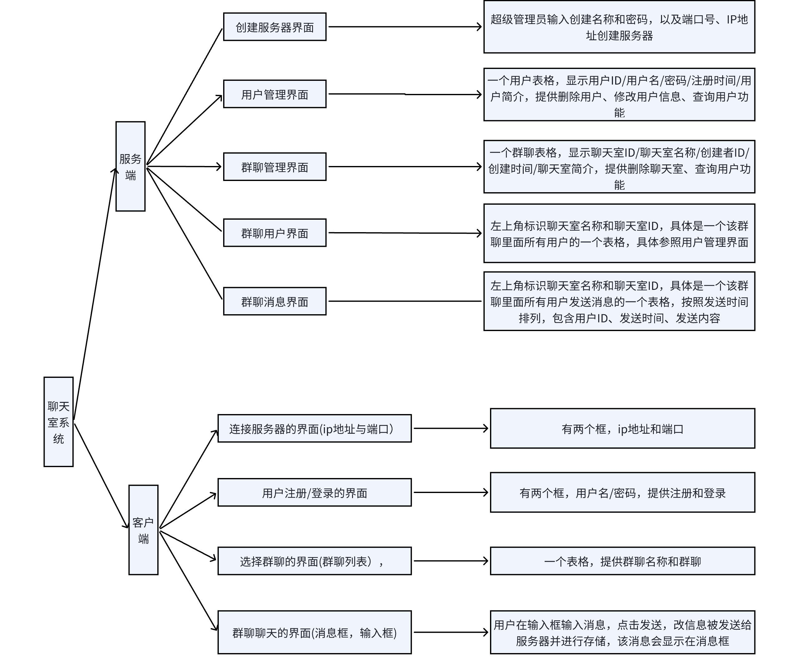

#### ER图

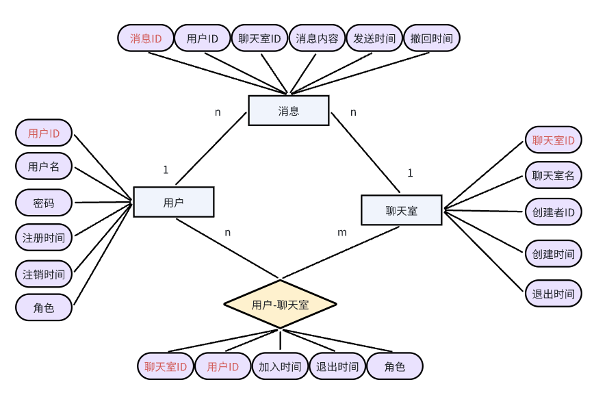

#### 网络通信示意图

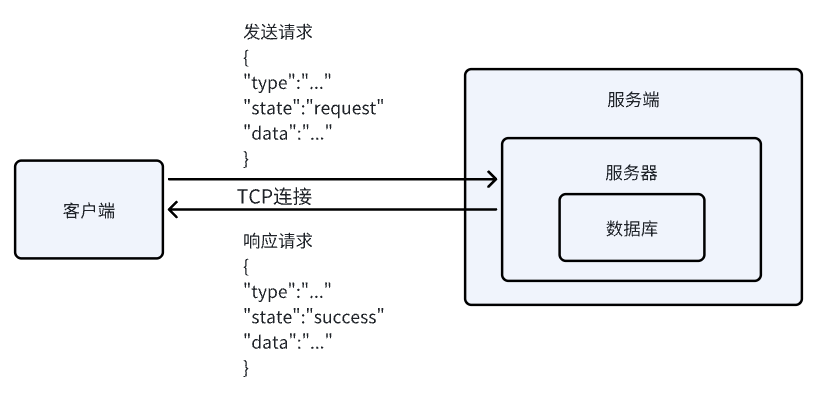

#### 服务端用户逻辑

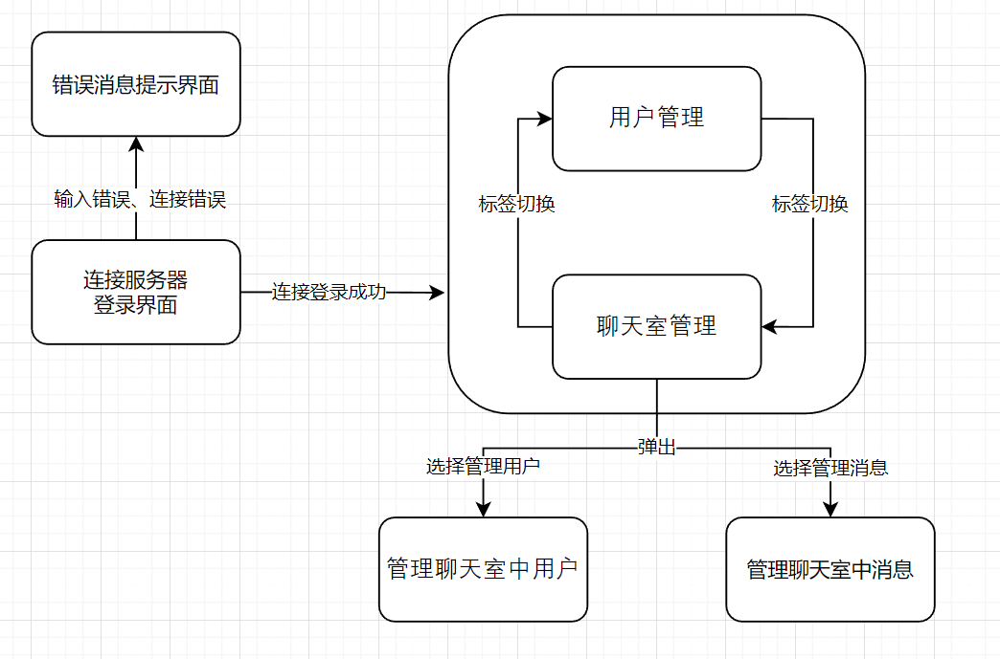

#### 客户端用户逻辑

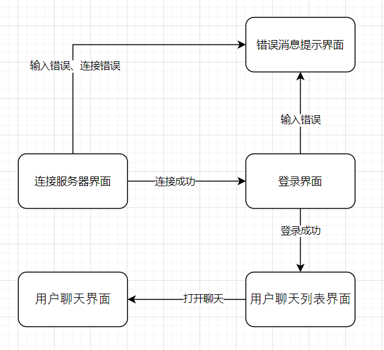

#### 服务端界面截图

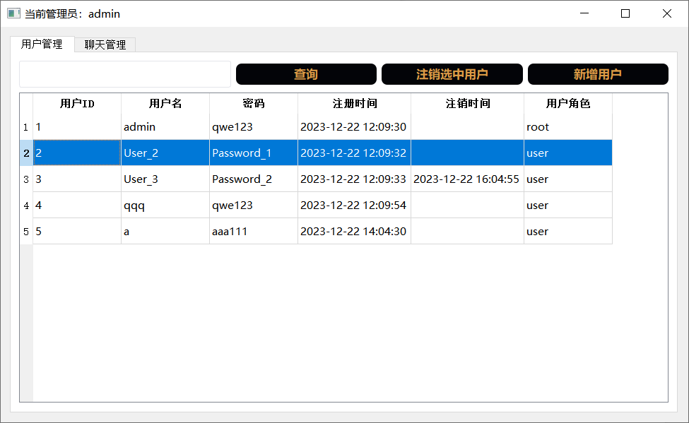

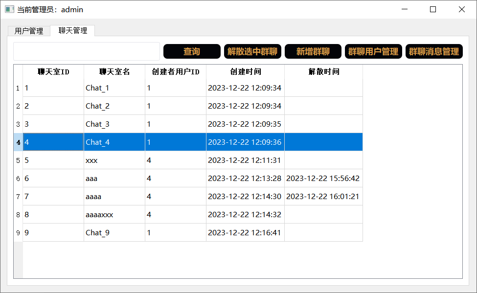

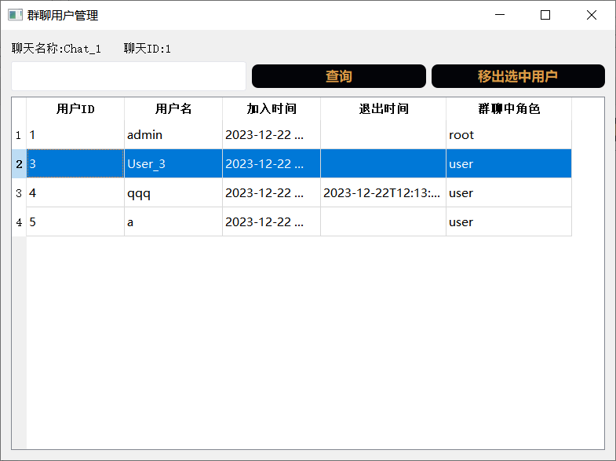

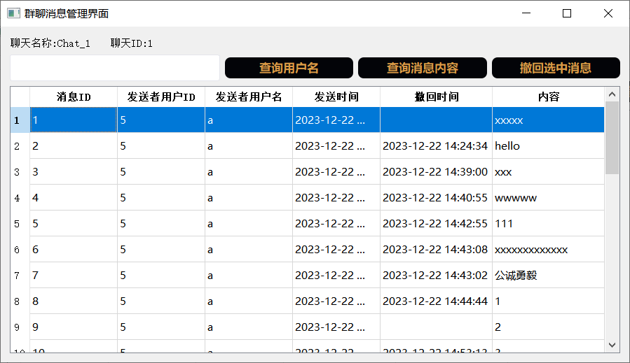

#### 客户端界面截图

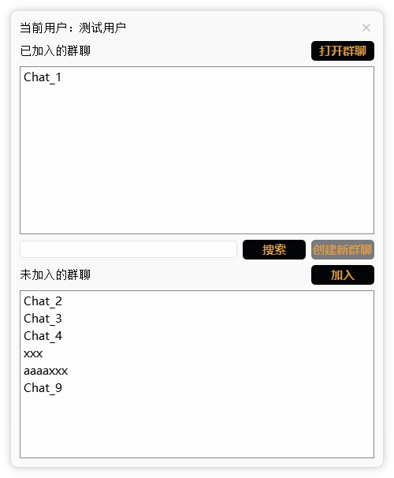

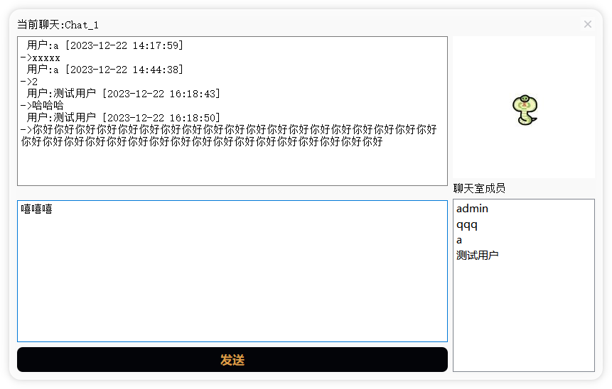