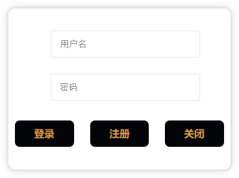

# QTChatroom

## 简介
本项目是一个用QT实现的桌面端自部署聊天室系统软件，含服务端和客户端，使用经过SSL加密的TCP通信和SQLite数据库管理系统。

软件作者：[@omigeft](https://github.com/omigeft) （后端开发），[@Futurow](https://github.com/Futurow) （UI设计），[@123duduke](https://github.com/123duduke) （数据库设计）

#### 运行方法

使用QT编译即可运行。作者测试时使用Qt5.12.9的MinGW64bit编译。

请注意一些约束比如用户名字符数1-20，密码字符数6-20且必须包含数字和字母。

服务器启动需要有SSL证书和密钥，作者编写了一个[Python脚本](server/src/generatecertandkey.py)用于生成自签名证书和密钥，如果服务器启动时找不到证书和密钥，会自动调用该脚本生成证书和密钥，需要本地配置了Python开发环境并安装了相应的库。此外，客户端会忽略自签名证书SSL错误来接受自签名证书。自签名证书与密钥仅用于测试和学习，请勿在生产环境中使用。对于生产环境，推荐使用由受信任证书颁发机构（CA）签发的证书。

#### 已实现的主要功能有
1. 建立服务器
2. 局域网通信
3. 用户、聊天室管理，包括用户聊天室的创建和消息撤回等
4. 客户端可以进行注册、登录、创建和加入聊天室以及文本聊天等操作
5. 生成自签名SSL证书和密钥来加密TCP通信过程

#### 计划表
1. 公网通信
2. 图片、文件传输等多媒体通信
3. 支持多国语言
4. 多线程的使用
5. 自定义样式皮肤、聊天室头像等
6. 将错误提示从终端显示改为弹窗/悬浮窗提示
7. 本地缓存聊天记录

#### 软件UI各界面介绍

#### ER图

#### 网络通信示意图

#### 服务端用户逻辑

#### 客户端用户逻辑

#### 服务端界面截图

#### 客户端界面截图

#### 开源许可证

本项目不作盈利目的，仅供学习交流用。项目代码的授权协议为[MIT License](LICENSE)，使用本源码时请遵守该协议。
